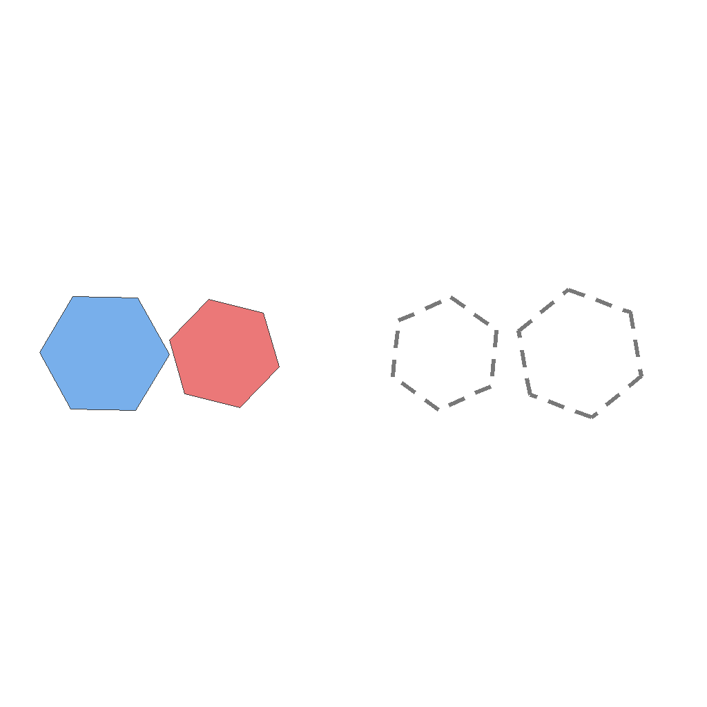
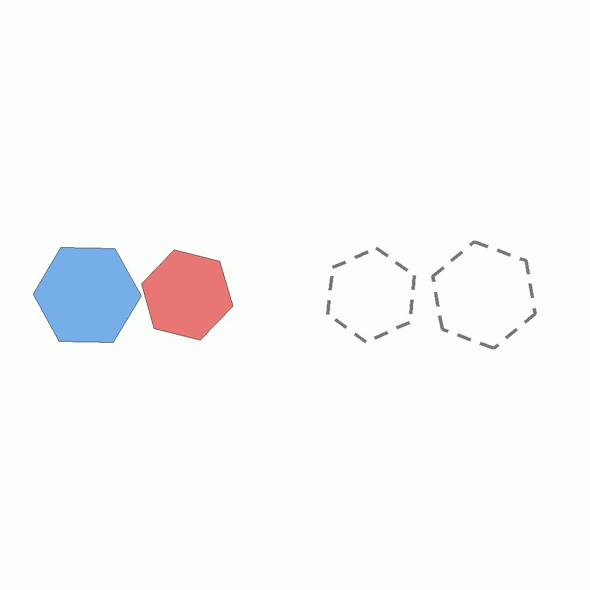
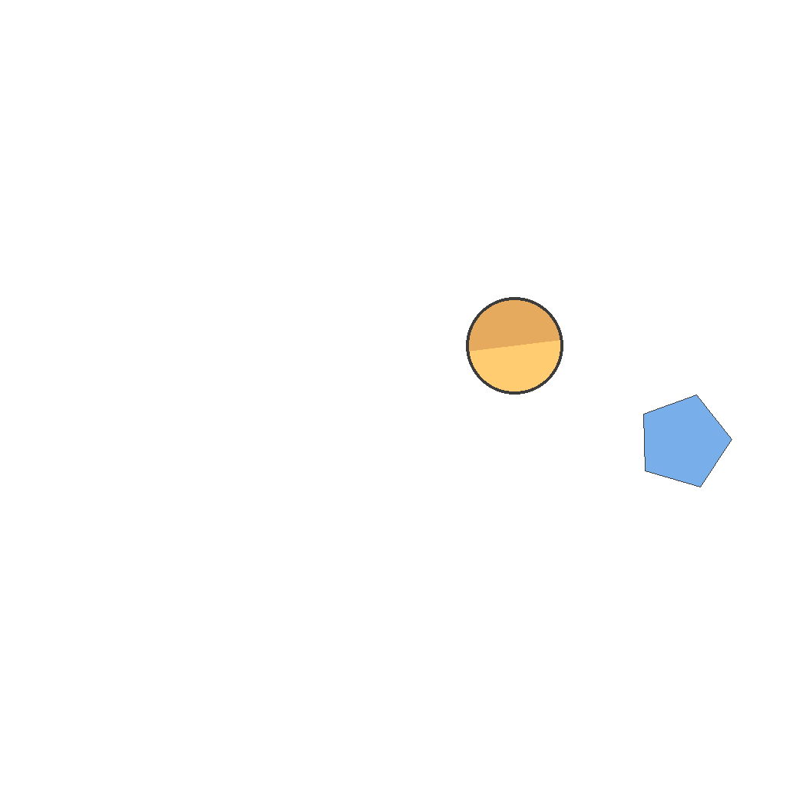

# G-40: Combined Objects Spinning Data Generator

Generates synthetic datasets for training and evaluating vision models on rotation and alignment tasks. Each sample contains objects that must be rotated to match target orientations before moving them to align with dashed outlines.

Each sample pairs a **task** (first frame + prompt describing what needs to happen) with its **ground truth solution** (final frame showing the result + video demonstrating how to achieve it). This structure enables both model evaluation and training.

---

## 📌 Basic Information

| Property | Value |
|----------|-------|
| **Task ID** | G-40 |
| **Task** | Combined Objects Spinning |
| **Category** | Visual Reasoning |
| **Resolution** | 1024×1024 px |
| **FPS** | 16 fps |
| **Duration** | ~3-4 seconds |
| **Output** | PNG images + MP4 video |

---

## 🚀 Usage

### Installation

```bash
# 1. Clone the repository
git clone https://github.com/VBVR-DataFactory/G-40_combined_objects_spinning_data-generator.git
cd G-40_combined_objects_spinning_data-generator

# 2. Create and activate virtual environment
python3 -m venv venv
source venv/bin/activate  # On Windows: venv\Scripts\activate

# 3. Install dependencies
pip install --upgrade pip
pip install -r requirements.txt
pip install -e .
```

### Generate Data

```bash
# Generate 50 samples
python examples/generate.py --num-samples 50

# Custom output directory
python examples/generate.py --num-samples 100 --output data/my_dataset

# Reproducible generation with seed
python examples/generate.py --num-samples 50 --seed 42

# Without videos (faster)
python examples/generate.py --num-samples 50 --no-videos
```

### Command-Line Options

| Argument | Description |
|----------|-------------|
| `--num-samples` | Number of tasks to generate (required) |
| `--output` | Output directory (default: `data/questions`) |
| `--seed` | Random seed for reproducibility |
| `--no-videos` | Skip video generation (images only) |

---

## 📖 Task Example

### Prompt

```
The scene shows 2 objects on the left side and dashed target outlines on the right side. The dashed target outlines remain completely stationary. For each object, first rotate it in place to match the orientation of its corresponding dashed target outline, then move it horizontally to the right so that it aligns exactly with and fits within its corresponding dashed target outline.
```

### Visual

<table>
<tr>
  <td align="center"></td>
  <td align="center"></td>
  <td align="center"></td>
</tr>
<tr>
  <td align="center"><b>Initial Frame</b><br/>Objects on left, dashed targets on right</td>
  <td align="center"><b>Animation</b><br/>Objects rotate then move to targets</td>
  <td align="center"><b>Final Frame</b><br/>Objects aligned with target outlines</td>
</tr>
</table>

---

## 📖 Task Description

### Objective
Rotate objects to match target orientations, then move them to align perfectly with corresponding dashed outlines.

### Task Setup
- **Objects**: Multiple shapes on left side with initial orientations
- **Target outlines**: Dashed silhouettes on right side (stationary)
- **Two-phase task**: (1) Rotate in place, (2) Move horizontally
- **Rotation requirement**: Must match target orientation before moving
- **Alignment goal**: Perfect fit within dashed outline
- **Background**: White with clear visibility
- **Goal**: Each object correctly rotated and positioned in its target

### Key Features
- Combined rotation and translation (two-step process)
- In-place rotation before movement
- Orientation matching with target silhouettes
- Multiple objects with independent rotations
- Tests understanding of sequential transformations
- Requires spatial reasoning and transformation planning

---

## 📦 Data Format

```
data/questions/combined_objects_spinning_task/combined_objects_spinning_0001/
├── first_frame.png          # Objects with initial orientations
├── final_frame.png          # Objects aligned with targets
├── prompt.txt               # Rotation and alignment instruction
└── ground_truth.mp4         # Animation of rotate-then-move process
```

**File specifications:**
- **Images**: 1024×1024 PNG format
- **Video**: MP4 format, 16 fps
- **Duration**: ~3-4 seconds

---

## 🏷️ Tags

`visual-reasoning` `rotation` `alignment` `transformation` `spatial-reasoning` `multi-step-task`

---
